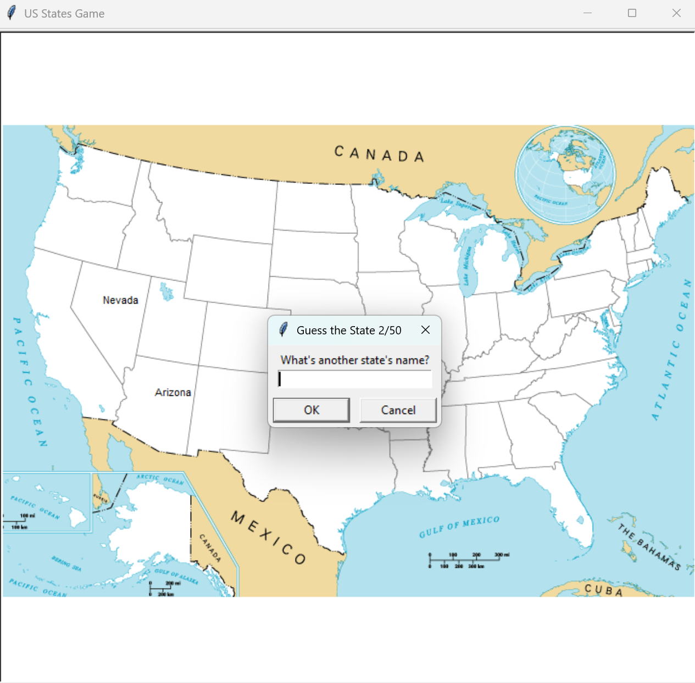

# US States Game

A fun educational game built with **Python**, **Turtle Graphics**, and **Pandas**.  
The goal of the game is to guess all 50 U.S. states. Each correct guess displays the state’s name on the U.S. map.

---

## ✨ Features

- Interactive map using **Turtle Graphics**.
- Guess state names until you complete all 50.
- Type `Exit` anytime to stop the game.
- Automatically generates a `states_to_learn.csv` file with the states you missed.

---

## 🛠️ Technologies Used

- [Python 3](https://www.python.org/)  
- [Turtle Graphics](https://docs.python.org/3/library/turtle.html) – for the game map  
- [Pandas](https://pandas.pydata.org/) – for handling state data  

---

## 📂 Project Structure

```
.
├── 50_states.csv          # CSV file with state names and coordinates
├── blank_states_img.gif   # U.S. map outline used for the game
├── main.py                # Main game logic
├── states_to_learn.csv    # Generated file containing states not guessed
├── requirements.txt       # Dependencies
├── LICENSE
└── README.md              # Project documentation
```

---

## 🚀 Getting Started

### 1. Clone the Repository
```bash
git clone https://github.com/SasaCejic/us-states-game.git
cd us-states-game
```

### 2. Install Dependencies
```bash
pip install -r requirements.txt
```

### 3. Run the Game
```bash
python main.py
```

---

## 📖 How to Play

1. A U.S. map outline will appear on screen.  
2. Enter a state’s name in the pop-up box.  
   - Correct guesses will display the state’s name on the map.  
3. Type **Exit** to quit the game early.  
   - A `states_to_learn.csv` file will be generated with the states you missed.  

---

## 📸 Screenshot

<p align="center">
  
</p>

---

## 📌 Future Improvements

- Add difficulty levels (e.g., timed mode).
- Provide hints for states not yet guessed.
- Support for other countries' maps.

---

## 👨‍💻 Author

Developed by **Saša Čejić**  
📧 Contact: cejicsasa17@gmail.com  

---

## 📝 License

This project is licensed under the MIT License.

